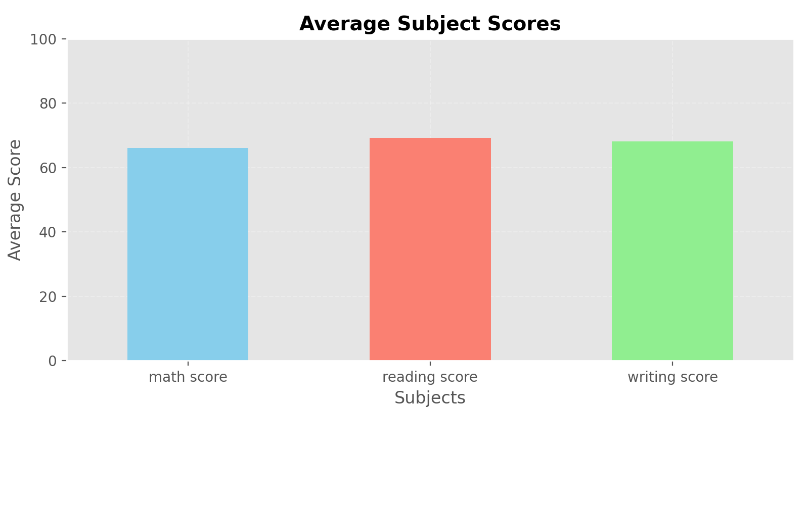
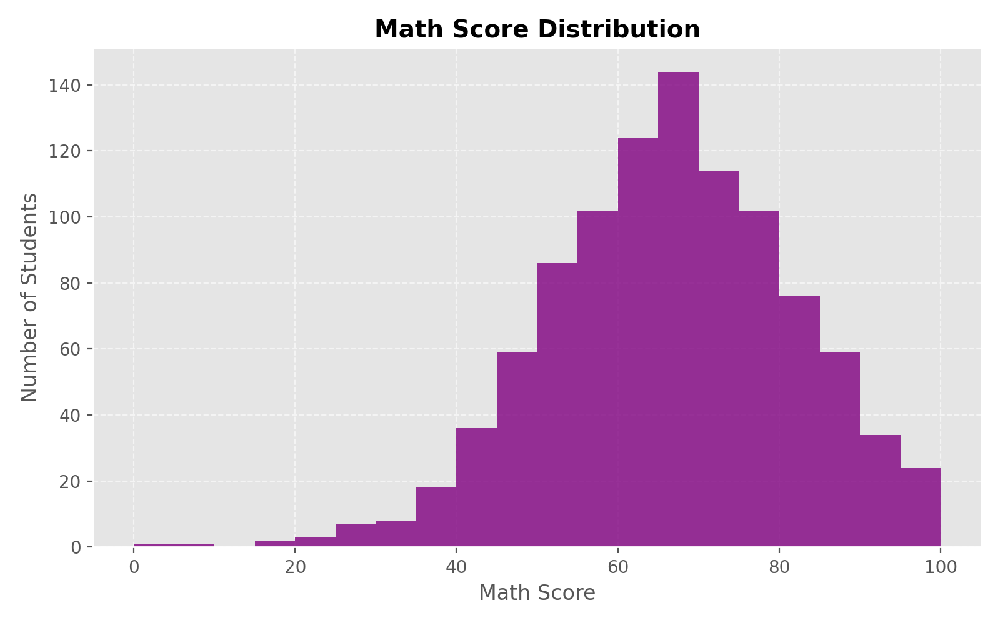
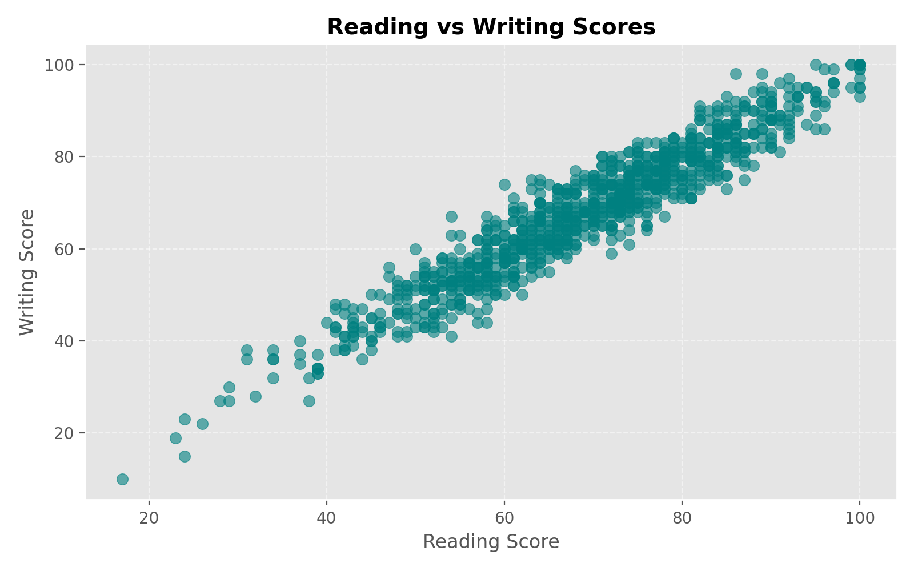
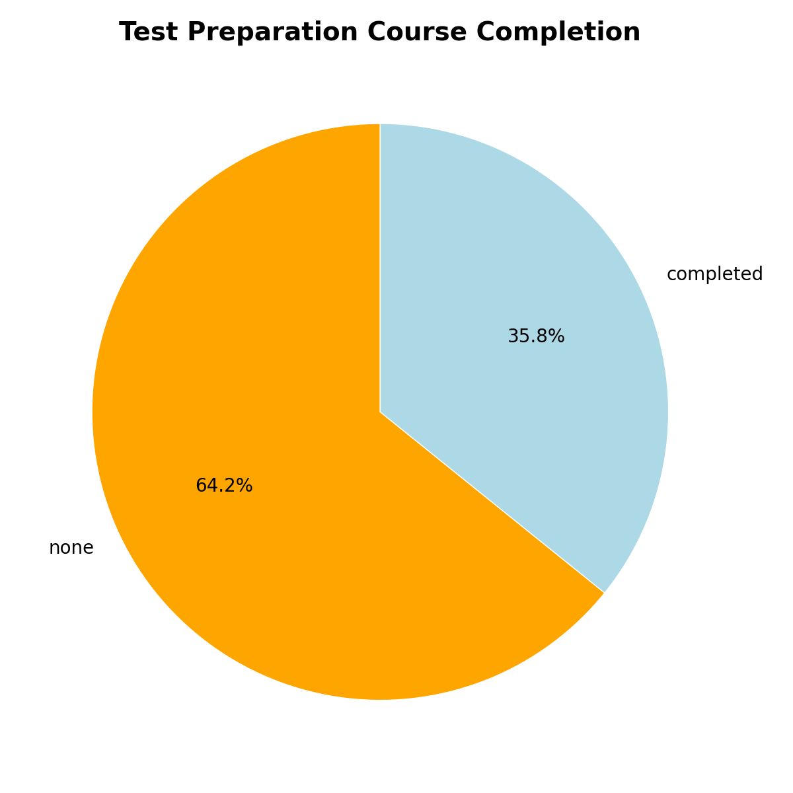

# 📊 Student Performance Analysis using Matplotlib

This project analyzes student exam performance using **Python, Pandas, and Matplotlib**.  
It uses a real-world dataset from Kaggle and creates multiple visualizations to understand student scores and trends.

---

## 📁 Dataset

**Name:** Students Performance in Exams  
**Source (Kaggle):**  
https://www.kaggle.com/datasets/spscientist/students-performance-in-exams

The dataset includes:
- math score  
- reading score  
- writing score  
- gender  
- parental level of education  
- lunch  
- test preparation course  

---

## 🛠️ Technologies Used

- Python  
- Pandas  
- Matplotlib  

---

## 📈 Visualizations Generated

### 1) Average Subject Scores
Shows the average marks in Math, Reading, and Writing.

---

### 2) Math Score Distribution (Histogram)
Shows how math scores are distributed among students.

---

### 3) Reading vs Writing Scores (Scatter Plot)
Shows the relationship between reading and writing scores.

---

### 4) Test Preparation Course Completion (Pie Chart)
Shows the percentage of students who completed the test preparation course vs those who did not.

---

## ▶️ How to Run the Project

1. Clone the repository:
  git clone https://github.com/itsayaanafsar/student-performance-analysis.git
2. Install the required libraries:
  pip install pandas matplotlib
3. Download the dataset from Kaggle and place StudentsPerformance.csv in the project folder.
4. Run the Python script:
   python student_performance.py
5. The graphs will:
-Be displayed on the screen
-Be saved as PNG files in the project directory

---

## 🎯 What This Project Demonstrates

-Loading and analyzing data using Pandas
-Creating clean and informative visualizations using Matplotlib
-Working with a real-world dataset
-Saving plots as image files for reports and documentation
